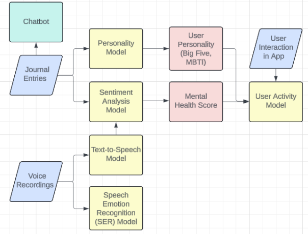

# An Intelligent Mobile Application to Identify Factors Influencing Adolescent Mental Health Variability Using Artificial Intelligence

## Abstract

Artificial intelligence has shown promise in diagnosing mental illness in young children, a challenging task given the rise in teenagers struggling with mental health. We focus on the capabilities of machine learning and natural language processing models to accurately recognize activities that affect mental health in pre-teens and adolescents, an important step towards improving symptoms of depression and anxiety. We achieve an accuracy of 86.7% for determining sentiment from child journal entries with LSTM and BERT and a MSE of 94.6 for predicting future mental health outcomes with neural networks. We develop an innovative solution of incorporating these models inside of a mobile application as a scalable framework for data collection to track shifts in overall user wellbeing.




```
📦 
├─ GPT_assistant.py                 # generate users and journals in batch files.
├─ README.md
├─ data
│  ├─ csv
│  │  ├─ agg_journals.csv
│  │  ├─ agg_journals_lstm.csv
│  │  ├─ journal_data.csv
│  │  ├─ predicted_sentiments.csv
│  │  ├─ predicted_sentiments_lstm.csv
│  │  ├─ user_data.csv
│  │  ├─ user_data_display.csv
│  │  ├─ user_scores.csv
│  │  ├─ user_scores_lstm.csv
│  │  └─ users.csv
│  ├─ journals
│  └─ users
├─ image
├─ journals_convert.py              # convert journal json to dataframe and combine all batch files into one. dataframe is used to feed into sentiment models to get a mental health score.
├─ model.py
├─ sentiment_analysis_models
│  ├─ BERT
│  │  └─ Bert.ipynb
│  ├─ LTSM
│  │  ├─ 1_preprocess_base.ipynb
│  │  ├─ 1_preprocess_base_optimized.ipynb
│  │  ├─ 2_BuildModel-Copy1.ipynb
│  │  ├─ 2_BuildModel.ipynb
│  │  ├─ GridSearch.ipynb
│  │  ├─ GridSearchLTSM.ipynb
│  │  └─ load.ipynb
│  ├─ RandomForest
│  │  └─ RandomForest.ipynb
│  └─ regression
│     ├─ LogisticsRegression.ipynb
│     ├─ Measurement.ipynb
│     └─ NaiveBayes.ipynb
├─ user_activity.py                 # define rule to generate user activities
├─ user_activity_models
│  ├─ LinearRegression.ipynb
│  ├─ NeuralNetworkRegression.ipynb
│  ├─ RandomForest.ipynb
│  ├─ SVM.ipynb
│  └─ Xgboost.ipynb
├─ user_analysis.ipynb              # validate GPT generated users.
├─ user_converter.py                # convert user json to dataframe and combine all batch files into one
├─ user_journal_filler.py           # calculate before/after mental health average scores from sentiment models, combine user activities to create a user dataframe, then feed this into user activity model.
└─ word_frequencies.py
```
